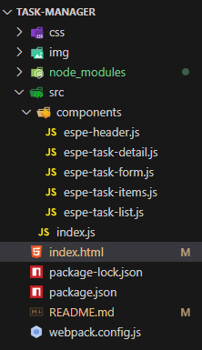
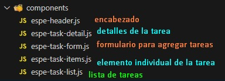

# **ESPE Tasks**

Este Laboratorio es una aplicación web para la gestión de tareas, donde puedes agregar, editar, marcar como completadas y eliminar tareas. Está desarrollado utilizando LitElement para la creación de componentes personalizados y Webpack para la construcción del proyecto.

## **Tecnologías Utilizadas**

- **LitElement**: Framework para crear componentes web.
- **Webpack**: Empaquetador de módulos.
- **CSS**: Estilos para la interfaz de usuario.
- **Git y GitHub**: Control de versiones y repositorio remoto.

## **Instalación**

Para instalar y configurar el proyecto en tu máquina local, sigue estos pasos:

### **1. Clona el repositorio**

Si aún no has clonado el repositorio, utiliza el siguiente comando para clonarlo:

```bash
git clone https://github.com/arquimides12/Lab2_U2.git
```
En mi caso sucedio esto ya que cree el repositorio despues.

# Instala las dependencias
Entra en el directorio del proyecto y ejecuta el siguiente comando para instalar las dependencias:

```bash
npm install
npm run serve
```
Esto abrirá la aplicación en http://localhost:8080.

## Estructrua del Proyecto 



## Componentes 
En este laboratorio los componentes era a preferencia del desarrollador en este caso se 
hicieron cinco dentro de la carpeta src los culaes son 




